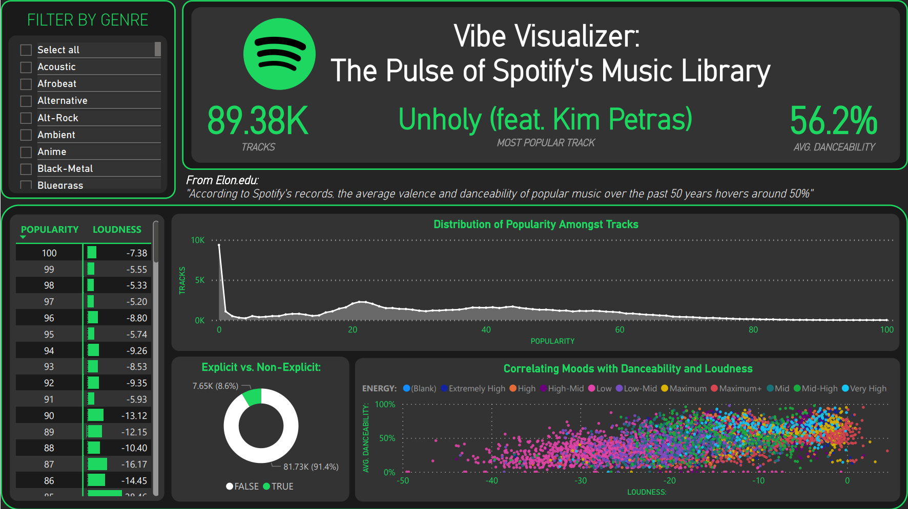
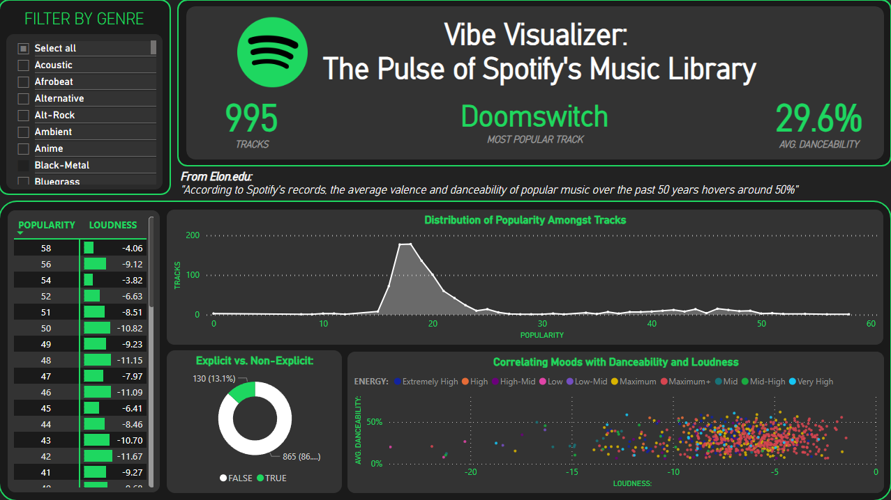

The goal of this project was to practice Power BI and strengthen my skills in Python a bit. Learned more about creating and applying functions as well as optimizing the dataset by setting appropriate datatypes. This didn't really matter in the end since Excel / Power BI messed with them anyway. I hadn't thought about that beforehand, but it was still fun to learn and apply it to something.

## **Default View**
- Header contains a few KPI metrics *(# of Tracks, Most Popular Track, Avg. Danceability)* as well as the title of the visual.
- Option to filter by genre via list (originally a dropdown but it seems you can't change the height of the list that appears when you click it).
- Matrix based on Popularity and Loudness and how they may possibly correlate.
- Radial chart for the Explicit column to show how many songs are Explicit / Non-Explicit. Has a bit more meaning when broken down by clicking data points on other charts.
- Area chart showing the popularity of X number of tracks.
- Scatter plot to show how loudness can correlate to the mood and danceability of a track.
  

---

## **Filtered by Genre (Black-Metal)**
Filtering the dataset down to Black-Metal updates the other charts with relevant data based on the selected genre. 

From this, we can understand a few things:
- (Matrix) The loudness is about midway on average (i'm surprised it's not louder. maybe there are some melodic / calmer bits?).
  - *I may add an avg. "total" field in this matrix so you can just know the average.a*
- (Area Chart) There are significantly more tracks between 15 and 25 Popularity, with this we can see that the average popularity of Black-Metal tracks isn't too high, and few that are decent.
- (Radial Chart) Selecting a genre like Black-Metal and then something like Ambient, or even Pop, it's clear that there are more tracks with swearing or expletives in a genre like Black-Metal that is typically associated with darker tones. Whereas Ambient or Pop are more calming or upbeat. It's just a radial chart so I have to make it seem cool.
- (Scatter Plot) With this chart, we can see that the Loudness seems to affect the Danceability and Energy of the track. The red area on the right is the "Maximum+" Energy level which is the highest. The danceability of these Black-Metal tracks isn't too high, but they are quite loud and very energetic - seems about right.
  - **Note**: These were originally decimal values, but I wanted to take at least two of the many numerical columns and convert them to a more categorical column.
  - In order: Low, Low-Mid, Mid, Mid-High, High-Mid, High, Very High, Extremely High, Maximum, Maximum+

