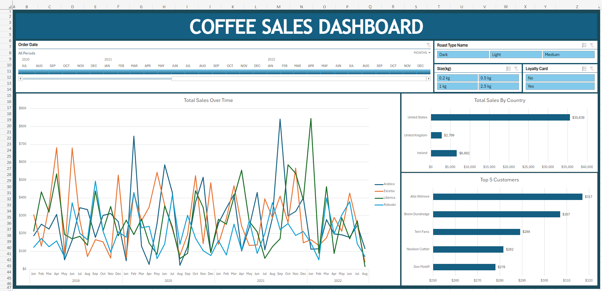
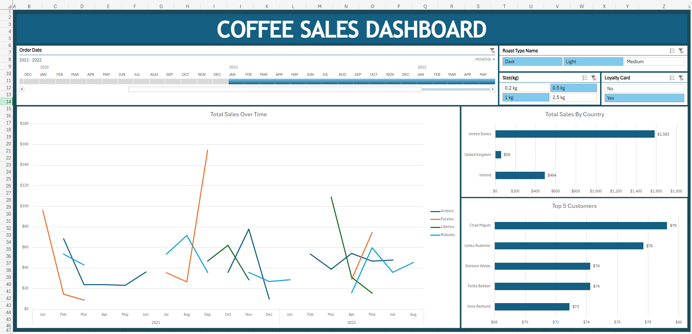

Excel project with the goal of creating a dashboard to display various sales data based on customers, country, etc. and to utilize formulas like XLOOKUP and INDEX/MATCH, pivot tables and charts.   

Project led by Mo Chen on YouTube: See [here](https://www.youtube.com/watch?v=m13o5aqeCbM)

## **Default Dashboard View**
- Line Chart displaying the total sales over time.
- Two Bar Charts displaying the total sales by country and the top 5 customers.
- Slicers for the weight, roast type (name), and loyalty card.

- With a few filters from the Slicers selected:

## **Excel Cloud Limitations** 
I do not have access to using the Desktop Excel version due to financial reasons so I am using the Cloud version of Excel instead. This comes with limitations, and there were some points in the tutorial where I ran into some.
- When using pivot tables, it isn't possible to group the data. As in, I can't right-click the PT and group by a certain data point. I had to split the order date into separate columns and then use the month name (e.g. "Jan"), and the Year.
  - I resolved this by using text-to-columns on the order date, and then just having to change the month from a number to the actual month name by using =TEXT(DATE([Year],[Month],[Day], "mmm")).  
---
- The ability to multi-select and even copy / cut Slicers isn't available in the Cloud version of Excel.
  - I had to copy the pivot tables in each sheet into a single column on the main dashboard sheet, create the charts and slicers again and then hide the column with the PTs. As opposed to simply copying he slicers and charts over.  
---
- Unable to Ctrl + Drag a sheet in-between two sheets to create a copy of it.
  - Just had to create a new sheet and manually copy the pivot tables into them.  
---
- Limited styling options for the Slicers, none for the Timeline (???).
  - Didn't use any custom coloring since the coloring / design by default was fine.  

---
